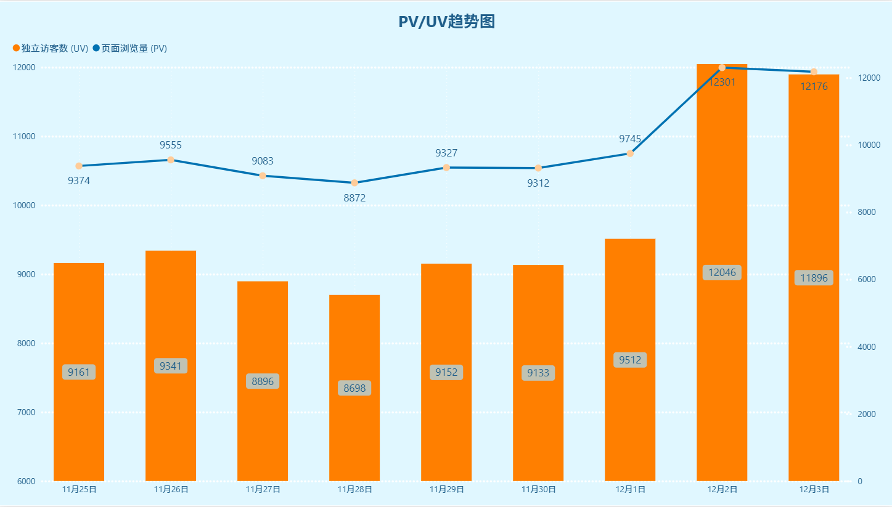
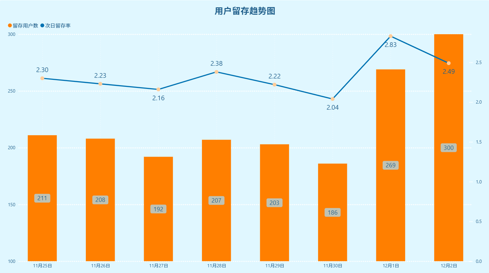
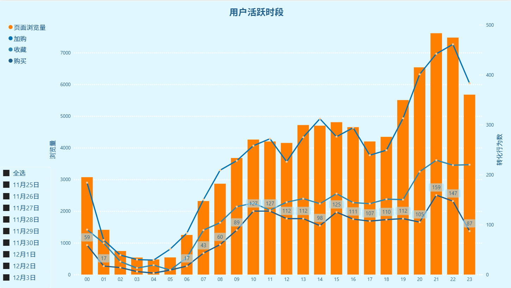
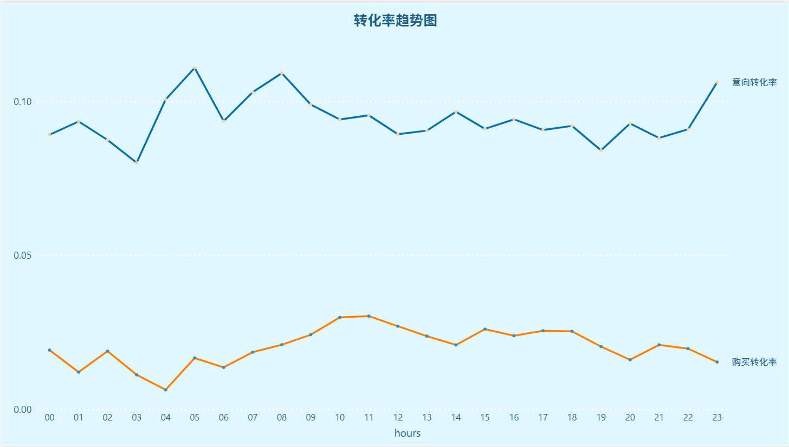
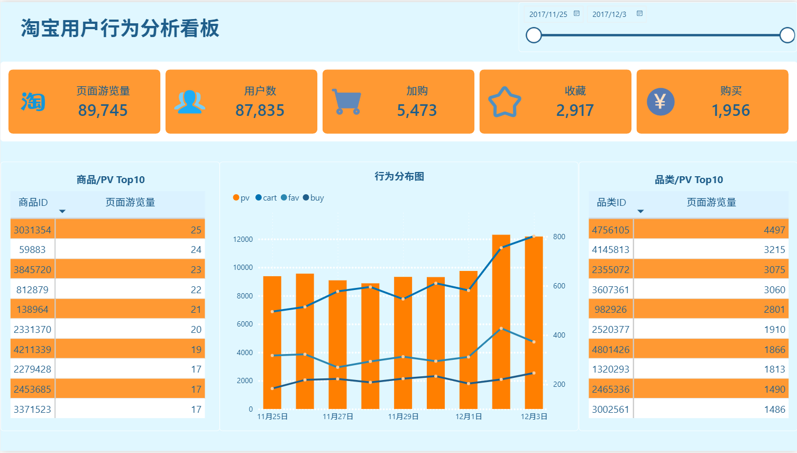

# 淘宝用户行为分析

## 项目背景
本项目基于淘宝用户行为数据，通过分析用户活跃规律、转化漏斗、用户价值分层及商品表现，为运营优化提供数据支持。

## 数据说明

- **数据来源**：阿里天池淘宝用户行为数据集
- **数据集链接**：https://tianchi.aliyun.com/dataset/649
- **原始数据量**：1亿条（2017-11-25 至 2017-12-03）
- **抽样数据量**：10万条（本分析使用）
- **抽样脚本**：`src/python/data_sampling.py`

### 核心字段说明

| 字段 | 说明 |
| :--- | :--- |
| User ID | 整数类型，序列化后的用户ID |
| Item ID | 整数类型，序列化后的商品ID |
| Category ID | 整数类型，序列化后的商品所属类目ID |
| Behavior type | 字符串，枚举类型，见下表 |
| Timestamp | 行为发生的时间戳 |

### 行为类型枚举

| 类型 | 说明 |
| :--- | :--- |
| pv | 商品详情页点击/浏览 |
| buy | 商品购买 |
| cart | 将商品加入购物车 |
| fav | 收藏商品 |

> 注：本分析基于抽样数据，结论反映趋势，全量数据下结果会更稳定。

## 项目结构
```text
taobao-user-behavior-analysis/
├── README.md # 项目说明
├── src/
│ ├── sql/ # 11个SQL分析脚本
│ └── python/ # 数据抽样脚本
├── data/ # 抽样数据（CSV）
├── images/ # PowerBI可视化截图
└── .gitignore
``` 

## 分析框架

### 1. 流量指标
- PV / UV / 人均浏览页数
- 结果表：`pv_uv_puv`

### 2. 活跃用户留存情况
- 次日/3日/7日留存率
- 结果表：`retention_rate`

### 3. 用户活跃时段分析
- 基于日期时间分析行为情况
- 结果表：`date_hour_behavior`

### 4. 转化漏斗分析
- 基于用户转化率分析统计各个行为的用户数，在 PowerBI 中构建转化漏斗趋势图
- 结果表：`behavior_user_num`

### 5. 行为路径分析
- 用户购买前的行为路径（如：浏览→加购→购买）
- 结果表：`path_result`

### 6. 用户价值分层（RFM）
- 基于R（最近购买）、F（购买频次）的用户分层
- 用户分类：价值用户、保持用户、发展用户、挽留用户
- 结果表：`rfm_model`

### 7. 商品分析
- 热门商品/品类（浏览量）
- 商品/品类转化率
- 高加购率低购买率品类（用户犹豫）
- 结果表：`popular_categories`、`popular_items`、`item_detail`、`category_detail`

## 核心结论

基于 2017-11-25 至 2017-12-03 的抽样数据（10万条），主要分析结论如下：

### 流量趋势分析



#### 平稳期（11月25日-11月30日）
- UV 稳定在 **8,698 ~ 9,512**  区间，PV 稳定在 **8,872 ~ 9,745** 区间
- 日均 UV 约 **9,080**，日均 PV 约 **9,278**
- PV/UV 比值稳定在 **1.0 ~ 1.02** 之间，用户人均浏览页数极低，页面粘性不足

#### 爆发期（12月1日-12月3日）
- **12月2日**达到峰值：UV 12046（环比 +26.6%），PV 12301（环比 +26.2%）
- 12月3日数据略有回落（UV 11896，PV 12176），但仍远高于前期水平，增长具备一定持续性

#### 关键洞察
- **用户规模突破**：后期 UV/PV 大幅上涨，说明 12 月前后的运营动作带来了有效用户增长
- **页面粘性不足**：全周期 PV/UV ≈ 1.0，用户平均仅浏览 1 页，需优化内容推荐和跳转引导
- **增长持续性待验证**：12月3日较峰值回落，需结合后续数据判断是一次性活动效应还是长期扩张

#### 优化建议
1. **复盘增长来源**：回溯 12 月前后的运营动作（推广活动、渠道投放、内容更新），明确增长驱动因素，可复制有效策略放大效果
2. **提升用户粘性**：优化页面内相关推荐、跳转引导或产品路径，引导用户浏览更多内容，提升人均访问深度
3. **监测增长持续性**：持续跟踪后续日度数据，判断用户规模的上涨趋势能否维持，为流量策略提供依据

### 用户留存分析



#### 分阶段特征

**平稳期（11月25日-11月30日）**
- 留存用户数稳定在 186~211 人区间，次日留存率在 2.04%~2.38% 之间小幅波动
- 11月30日为阶段低点（留存用户数 186，留存率 2.04%），该阶段留存表现偏弱

**爆发期（12月1日-12月2日）**
- 12月1日：留存用户数 269（环比 +44.6%），留存率 2.83%（环比 +38.7%），达到周期最高点
- 12月2日：留存用户数增至 300（环比 +11.5%），但留存率回落至 2.49%，新增用户中低质量用户占比有所上升

#### 关键洞察

- **留存规模扩张**：后期留存用户数上涨与 UV/PV 增长趋势一致，新增用户具备基础留存能力
- **留存质量分化**：12月1日留存率冲高后回落，后期新增用户留存质量下滑，可能存在流量渠道质量下降或承接不足的问题
- **留存率整体偏低**：全周期最高留存率仅 2.83%，产品核心吸引力或新用户引导环节存在明显短板

#### 优化建议

1. **提升留存率**：优化新用户引导流程、首单福利或核心功能体验，降低首次使用后的流失率
2. **监控新增用户质量**：回溯后期流量渠道，区分高留存与低留存用户的来源，优化渠道投放策略
3. **巩固留存增长**：针对留存用户数的上涨趋势，推出分层运营策略，对高留存用户进行精细化运营

> 注：12月3日为数据截止日，无次日数据。

### 用户活跃时段



#### 整体活跃分布

- **浏览量（柱状图）**：全天呈双峰分布，主高峰在 21-22 点，次高峰在 10-16 点；凌晨时段（00-06 点）浏览量最低
- **转化行为（折线图）**：与浏览量趋势高度正相关，主高峰同样在 21-22 点，22 点达到转化峰值；04-05 点为全天转化低谷

#### 关键时段特征

| 时段 | 活跃特征 | 业务解读 |
| :--- | :--- | :--- |
| 凌晨（00-06 点） | 浏览量、转化量均处低位 | 用户休息时段，可暂停非必要的运营推送 |
| 早间（07-09 点） | 快速上升，09 点后进入稳定增长期 | 用户通勤/上班时段，碎片化浏览启动 |
| 午间（10-16 点） | 浏览量稳定在 4000-5000，转化量 100-300 | 工作日核心活跃时段，是运营投放的次优窗口 |
| 晚间（19-23 点） | 浏览量、转化量同步冲高，21-22 点达峰值 | 用户晚间休闲时段，浏览与转化的黄金时段 |

#### 转化效率对比

- **晚间 21-22 点**：不仅是浏览量高峰，转化效率也是全天最高，用户购买意愿最强
- **午间 10-16 点**：浏览量稳定，但转化效率略低于晚间，用户以“浏览对比”为主

#### 运营优化建议

1. **高峰时段重点运营**：将限时活动、弹窗推送、客服资源集中在晚间 21-22 点，最大化转化承接效率
2. **低谷时段降本增效**：凌晨 00-06 点暂停广告投放与主动推送，降低无效曝光成本
3. **分时段精细化策略**：针对午间“高浏览低转化”的特征，推出“预约下单、晚间支付”的引导策略，将午间浏览用户的转化行为引导至高峰时段

### 用户转化率分析



#### 整体转化水平对比

- **意向转化率**（加购+收藏）：全天维持在 8%-11% 区间，是购买转化率的 3-4 倍，说明从“有意向”到“完成购买”存在明显流失
- **购买转化率**：全天维持在 1%-3% 区间，整体水平偏低，波动幅度远小于意向转化率

#### 关键时段特征

| 指标 | 高峰时段 | 低谷时段 | 特征解读 |
| :--- | :--- | :--- | :--- |
| 意向转化率 | 05点、08点、23点 | 03点、19点 | 凌晨5点和早8点是用户意向最高时段，夜间23点再次冲高，符合碎片化浏览习惯；凌晨3点和晚7点为全天最低 |
| 购买转化率 | 10-11点、15点、17-18点 | 04点、01点 | 工作日上午10-11点、下午中段转化表现最好，凌晨4点为全天最低，用户更偏向在工作时段完成购买决策 |

#### 转化漏斗异常点

- **意向转化率波动剧烈**：高峰与低谷差值超过 30%，用户意向行为受时段影响极大，流量质量在不同时段差异显著
- **购买转化率波动平缓**：全天波动幅度不足 1%，用户购买决策的时段稳定性更强，高意向时段的转化承接存在流失

#### 运营优化建议

1. **高峰时段强化承接**：在意向转化率高峰（05/08/23点）加推促活弹窗、限时福利，减少意向到购买的流失
2. **低谷时段精准投放**：在购买转化率低谷（04/01点）减少低效投放，将预算倾斜至购买转化高峰时段
3. **漏斗缺口专项优化**：针对意向高、购买低的时段（如05点），排查支付流程、商品库存、客服响应等环节的流失问题

### 行为路径分析

> 注：基于抽样数据，购买样本量较小（1951人），行为路径分布仅供参考。

- **直接购买**：1951人（占比最高）
- **浏览后购买**：4人
- **加购后购买**：1人

由于抽样数据量有限，其他路径（如浏览+加购+购买、收藏+购买等）样本量过低，抽样数据下用户多为决策路径短、直接下单，缺少浏览 - 加购 - 收藏 - 复购完整链路；建议全量数据再做深度路径钻取与流失节点定位。

### 用户价值分层（RFM）

> 注：本分析基于抽样数据（10万条），购买用户样本量较小（1951人），RFM分层结果仅供参考。

- **价值用户**：高消费频次 + 高最近购买（近期活跃）
- **保持用户**：高消费频次 + 低最近购买（历史活跃，近期沉默）

由于抽样数据量有限，仅识别出两类用户群体。**后续优化方向**：在完整数据集（1亿条）上重新运行RFM模型，可完整划分重要价值、重要保持、重要发展、重要挽留四类，适配精细化运营推送、会员分层、定向优惠券投放。


## 技术栈
- **MySQL**：数据清洗、指标计算、RFM分层、行为路径分析
- **PowerBI**：可视化看板（动态交互）
- **Python**：数据抽样

## 如何运行
1. 执行 `src/sql/00-数据库与表初始化.sql` 创建数据库和表
2. 执行 `01-数据质量检查.sql` 验证数据完整性
3. 按顺序执行 `02` 至 `11` 脚本
4. 将 PowerBI 连接 MySQL，导入结果表进行可视化

## 可视化看板


[点击此处查看动态报表](https://pan.baidu.com/s/1zzV7YAtFnP1tmJf3S7vkhw?pwd=1206)

## 文件说明
| 文件名 | 内容 |
| :--- | :--- |
| `00-数据库与表初始化.sql` | 创建数据库和表 |
| `01-数据质量检查.sql` | 空值、重复值检查 |
| `02-数据预处理.sql` | 去重、异常值过滤、时间字段拆分 |
| `03-流量指标获取情况.sql` | PV、UV、人均浏览页数 |
| `04-活跃用户留存情况.sql` | 次日/3日/7日留存率 |
| `05-用户活跃时段.sql` | 按小时统计活跃度 |
| `06-转化漏斗分析.sql` | 浏览→加购→购买转化率 |
| `07-行为路径分析.sql` | 用户购买前的行为路径 |
| `08-RFM用户分层.sql` | R/F 分值计算与用户分层 |
| `09-商品热度分析.sql` | 热门商品/品类 |
| `10-商品转化率分析.sql` | 商品/品类转化率 |
| `11-商品特征分析.sql` | 高加购率低购买率品类 |

## 项目难点与解决
1.  **数据量大**：原始数据 1 亿条，本地无法直接处理 → 通过 Python 抽样 10 万条，保证分析效率
2.  **数据质量问题**：存在异常时间戳和空值 → 用 SQL 完成数据清洗，保证分析结果可靠
3.  **RFM 模型局限**：抽样数据中购买用户少，分层效果有限 → 补充了对后续全量数据优化方向的思考

## 联系方式
- 邮箱：wwwjjj618@qq.com
- GitHub：https://github.com/wj-04-wj/taobao-user-behavior-analysis